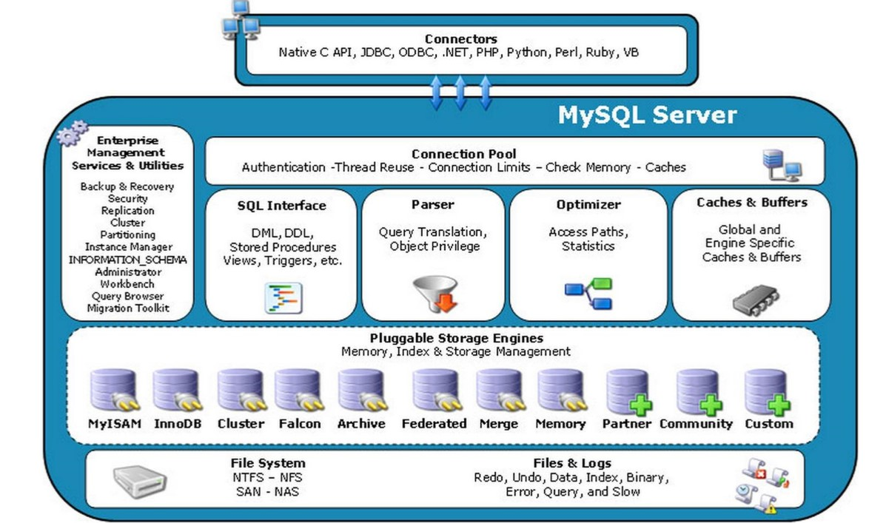
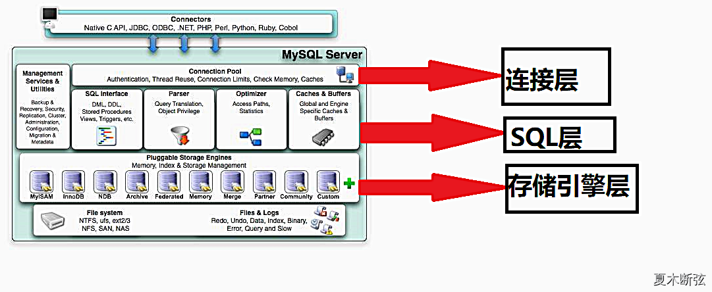
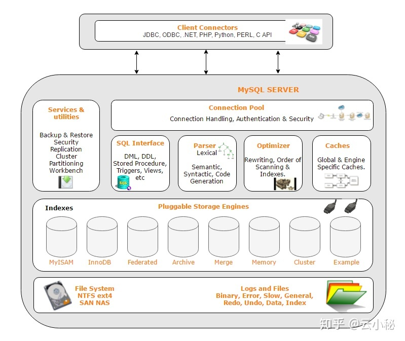
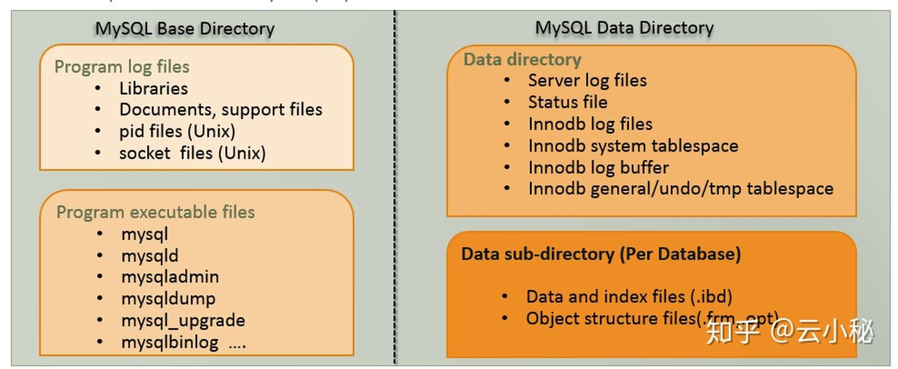

# MySQL概览

MySQL是目前最主流的关系型数据库。

* `MySQL`
  * 一句话描述：一种开源的关系型数据库管理系统
  * 官网
    * http://www.mysql.com
  * 体系架构
    * 
      * 
    * 
  * 细节
    * 默认端口：`3306`
    * 配置文件：`my.cnf`
    * 物理结构
      * 
  * 文档
    * 主入口
      * MySQL :: MySQL Documentation
        * https://dev.mysql.com/doc/
    * 参考手册
      * MySQL :: MySQL 8.0 Reference Manual
        * https://dev.mysql.com/doc/refman/8.0/en/
