# Sequel Pro

* `Sequel Pro`：数据库工具
  * 可用来管理MySQL数据库
    * 

## Sequel中新建mysql数据库并新建表和相应字段

sequel中，创建对应的mysql数据库，以及在数据库中创建对应的表，和相应字段

点击左上角的按钮，选择：`Add Database`：

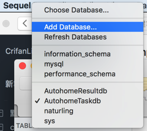

输入数据库信息：

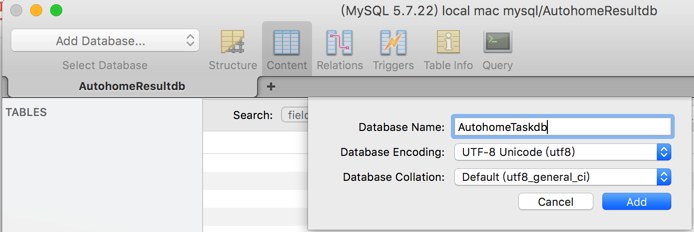

* `Database Name`：`AutohomeProjectdb`
* `Database Encoding`: `UTF-8 Unicode(utf8)`
* `Database Collation`: `Default (utf8_general_ci)`

再去切换到，刚建好的数据库：`AutohomeProjectdb`

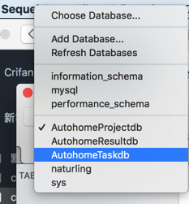

再去创建对应的table：

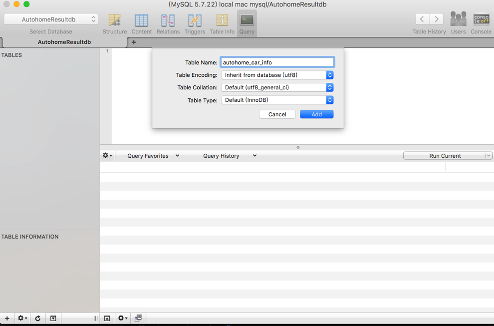

* `Table Name`：`autohome_car_info`
* `Table Encoding`: `inherit from database (utf8)`
* `Table Collation`: `Default (utf8_general_ci)`
* `Table Type`: `Default (InnoDB)`

点击`Add`

然后有了主键id

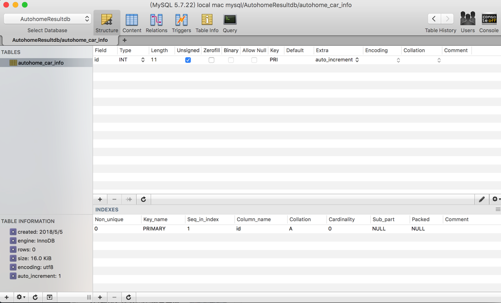

且默认已经帮忙配置好了`auto increment`=`自增`

再去添加其他字段：

点击左下角的`+`，去新建字段

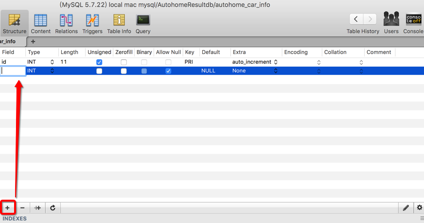


相关属性解释：

* `PK`=`primary key`=`主键`
* `NN`=`not null`=`非空`
* `UQ`=`unique`=`唯一`
* `BIN`=`binary`=`二进制数据`：比text更大
* `UN`=`unsigned`=`无符号`：非负数
* `ZF`=`zero fill`=`填充0`：例如字段内容是`1 int(4)`, 则内容显示为`0001`
* `AI`=`auto increment`=`自增`

此处调整字段属性为自己的需求：

* 没必要`ZF`，所以去掉
  * 取消勾选`ZeroFill`
* 也不允许NULL，默认为0
  * 取消勾选`Allow Null`
* `Extra`为空
  * `Extra`改为`None`

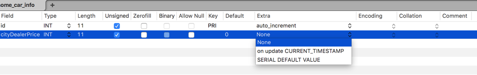

用类似方式，再去新建其他字段

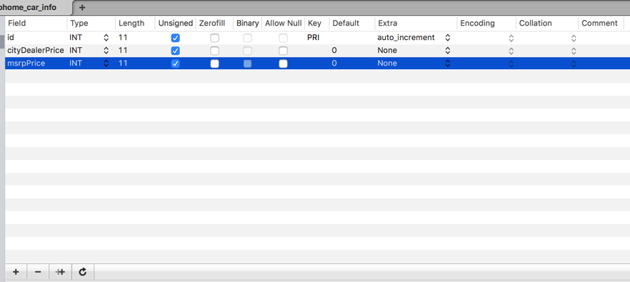

最后新建的各个字段为：

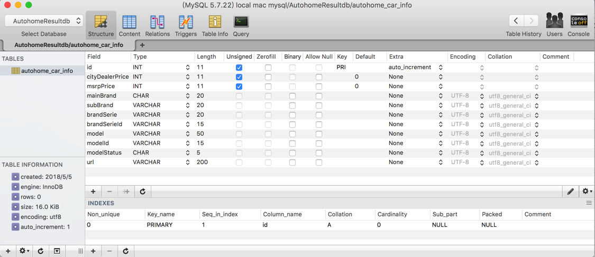

其中：

* 字段`mainBrand`=主品牌：类型是`CHAR`
  * 设计考虑点是
    * `char(n)`：适合保存，基本上确定了不会超过n个字符的，个数变化不大的
      * 此处汽车主品牌的名字，不会太长，所以用`CHAR`，暂定最多`20`个字符
    * `varchar(n)`：适合保存，基本上不太会超过n个字符，但是个数可能会变化的

## 使用心得

### 刷新

比如 导入了数据到MySQL中之后，需要刷新：

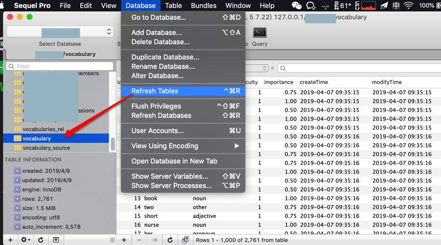

才能看到最新（已导入）的数据。

### 拷贝已有内容为sql语句

对于之前手动录入的内容，全选后，右击，支持：`Copy as SQL INSERT`

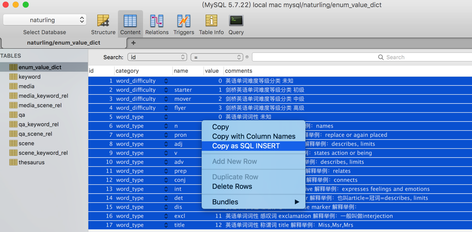

从而拷贝出sql语句：

```sql
INSERT INTO `enum_value_dict` (`id`, `category`, `name`, `value`, `comments`)
VALUES
    (1, 'word_difficulty', '', 0, '英语单词难度等级分类 未知'),
    (2, 'word_difficulty', 'starter', 1, '剑桥英语单词难度等级分类 初级'),
    (3, 'word_difficulty', 'mover', 2, '剑桥英语单词难度等级分类 中级'),
    (4, 'word_difficulty', 'flyer', 3, '剑桥英语单词难度等级分类 高级'),
    (5, 'word_type', '', 0, '英语单词词性 未知'),
    (6, 'word_type', 'n', 1, '英语单词词性 名词 noun 解释举例：names'),
    (7, 'word_type', 'pron', 2, '英语单词词性 代词 pronoun 解释举例：replace or again placed'),
    (8, 'word_type', 'adj', 3, '英语单词词性 形容词 adjective 解释举例：describes, limits'),
    (9, 'word_type', 'v', 4, '英语单词词性 动词 verb 解释举例：states action or being'),
    (10, 'word_type', 'adv', 5, '英语单词词性 副词 adverb 解释举例：describes, limits'),
    (11, 'word_type', 'prep', 6, '英语单词词性 介词 preposition 解释举例：relates'),
    (12, 'word_type', 'conj', 7, '英语单词词性 连词 conjunction 解释举例：connects'),
    (13, 'word_type', 'int', 8, '英语单词词性 疑问词 interrogative 解释举例：expresses feelings and emotions'),
    (14, 'word_type', 'det', 9, '英语单词词性 限定词 determiner 解释举例：也叫article=冠词=describes, limits'),
    (15, 'word_type', 'dis', 10, '英语单词词性 话语标记 discourse marker 解释举例：'),
    (16, 'word_type', 'excl', 11, '英语单词词性 感叹词 exclamation 解释举例：一般叫做interjection'),
    (17, 'word_type', 'title', 12, '英语单词词性 称谓词 title 解释举例：Miss,Msr,Mrs');
```

后续可用于其他地方，比如：

去另外一个在线mysql中插入同样内容

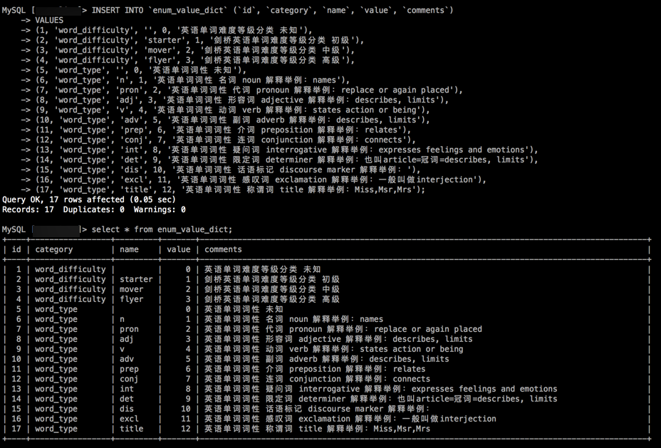

## 常见问题

### Unable to connect to host 127.0.0.1, or the request timed out

* 现象

在Mac中，虽然之前用mysql的命令行把安装时的临时密码修改过了，且终端中也可以用：

```bash
mysql -u root -p
```

再输入密码，而进去mysql了。

但是此处工具`Sequel Pro`中，却无法连接：

* host：`127.0.0.1`
* user：`root`
* password：xxx
* port：`3306`

而报错：

```bash
Connection Failed
Unable to connect to host 127.0.0.1, or the request timed out
```

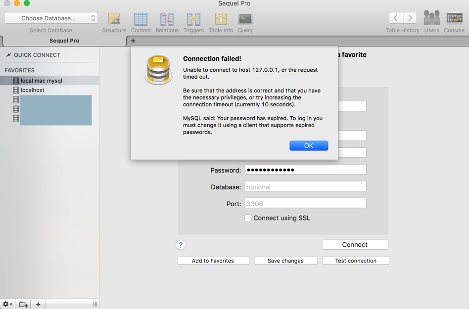


而再去找具体提示中的原因是：

```bash
Your password has expired. To log in you must change it using a client that supports expired passwords.
```

而具体解决办法是：

再去终端中进去mysql：

```bash
mysql -u root -p
```

然后，先选择对应的mysql数据库：

```sql
>use mysql;
```

会提示你：

```bash
ERROR 1820 (HY000): You must reset your password using ALTER USER statement before executing this statement.
```

然后才能设置新密码：

```sql
SET PASSWORD = PASSWORD('yourNewPassword');
```

(如果需要)再去设置密码不过期：

```sql
use mysql;
update user set password_expired='N' where user='root';
```

最后记得保存/同步/更新后再退出：

```sql
flush privileges;
quit
```

然后`Sequel Pro`中就可以用新密码去正常连接了。

### 运行多行mysql语句

sequel中，要是运行多行sql语句，则

* 应该是：`Run All Queries`
  * 图
    * 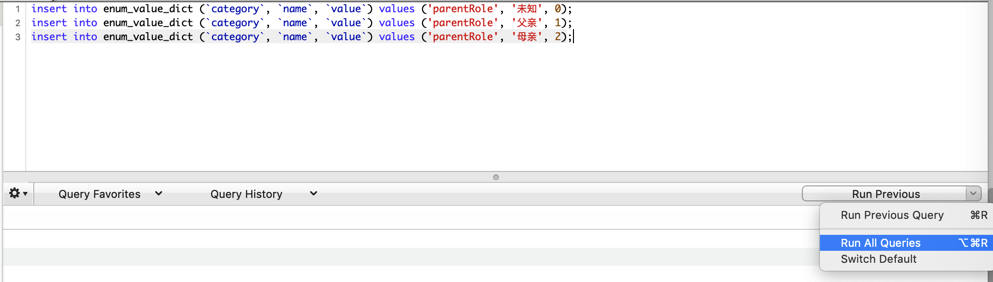
  * 底部提示的执行结果中，才能看到想要的：`N rows affected`
* 而不是：`Run Previous`
  * 否则多行语句，只能执行最后一行，之前的行，不会执行
  * 底部提示的执行结果中，也只能看到：`1 rows affected`

###  删除表出错：MySQL said: Cannot delete or update a parent row: a foreign key constraint fails

Sequel中，去右键删除某个表：

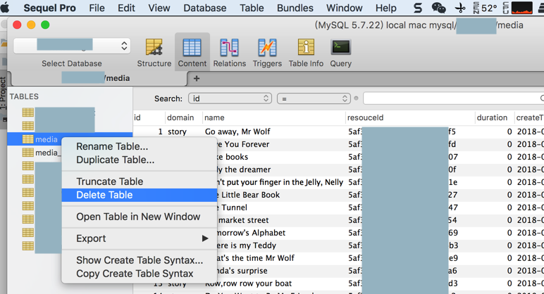

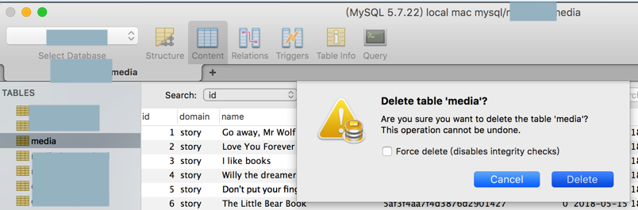

结果报错：

```bash
Error
Couldn't delete 'media'.
Selecting the 'Force delete' option may prevent this issue, but may leave the database in an inconsistent state.
MySQL said: Cannot delete or update a parent row: a foreign key constraint fails
```

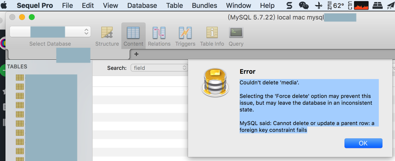

原因：此表某字段有外键和依赖关系

解决办法：

* 关闭（外键检查的）限制
  ```bash
  SET FOREIGN_KEY_CHECKS=0;
  ```

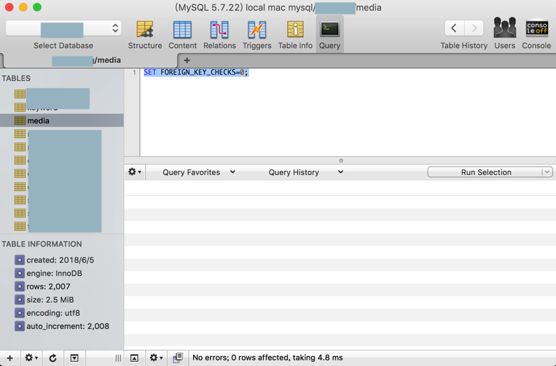

* 去操作，删除表

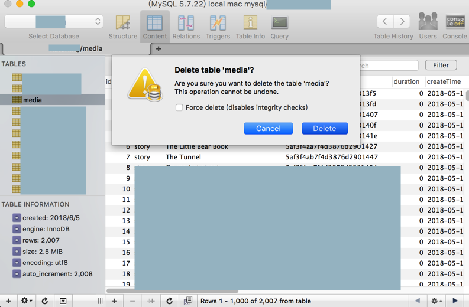

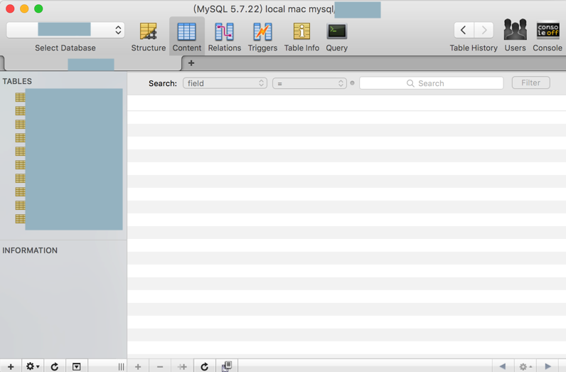

* （更新了个别字段后，重新）创建之前的表

```sql
CREATE TABLE `media` (
  `id` int(11) NOT NULL AUTO_INCREMENT,
  `domain` char(20) NOT NULL,
  `name` char(200) DEFAULT NULL,
  `resouceId` char(200) NOT NULL,
  `duration` float DEFAULT NULL,
  `createTime` datetime DEFAULT NULL,
  `modifyTime` datetime DEFAULT NULL,
  `createUser` int(11) DEFAULT NULL,
  `modifyUser` int(11) DEFAULT NULL,
  `active` char(1) DEFAULT 'Y',
  `publisher` text,
  `authors` char(50) DEFAULT NULL,
  `series` char(200) DEFAULT NULL,
  `seriesNumber` int(11) NOT NULL DEFAULT '1',
  PRIMARY KEY (`id`)
) ENGINE=InnoDB DEFAULT CHARSET=utf8;
```

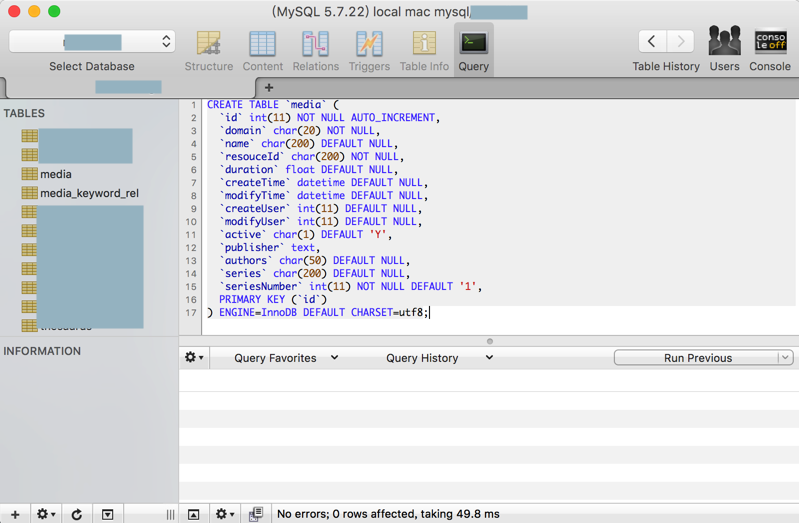

* 重新开启（外键检查的）限制
  ```bash
  SET FOREIGN_KEY_CHECKS=1;
  ```

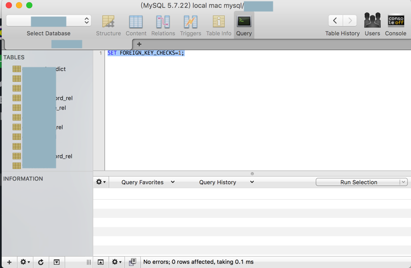

如此即可满足需求。

且之前的两个表（`media_keyword_rel`和`media_scene_rel`）的逻辑结构也还是没有变的，正常的外键依赖。

