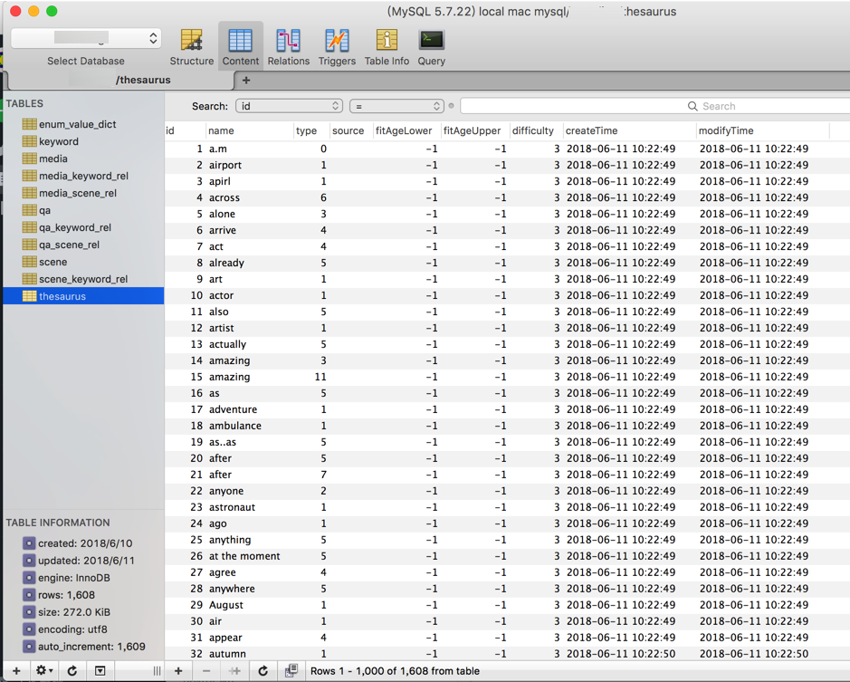
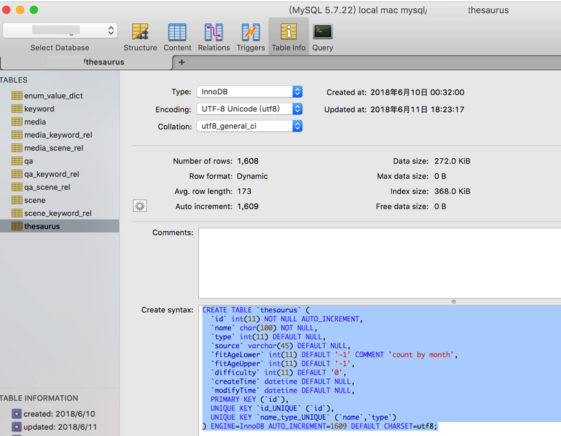
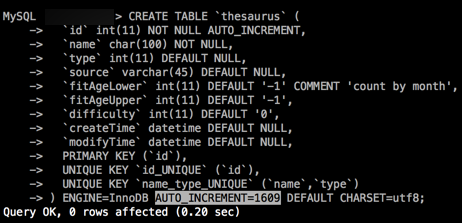

# MySQL心得

## `create table`的sql语句中，注意新建表时，去掉`AUTO_INCREMENT=xxx`

对于一个mysql的某个表，本地已经调试完毕，插入了很多数据（1608条）：



需要在在线数据库中新建该表，然后就参考了`table info`中的sql语句：

```sql
CREATE TABLE `thesaurus` (
  `id` int(11) NOT NULL AUTO_INCREMENT,
  `name` char(100) NOT NULL,
  `type` int(11) DEFAULT NULL,
  `source` varchar(45) DEFAULT NULL,
  `fitAgeLower` int(11) DEFAULT '-1' COMMENT 'count by month',
  `fitAgeUpper` int(11) DEFAULT '-1',
  `difficulty` int(11) DEFAULT '0',
  `createTime` datetime DEFAULT NULL,
  `modifyTime` datetime DEFAULT NULL,
  PRIMARY KEY (`id`),
  UNIQUE KEY `id_UNIQUE` (`id`),
  UNIQUE KEY `name_type_UNIQUE` (`name`,`type`)
) ENGINE=InnoDB AUTO_INCREMENT=1609 DEFAULT CHARSET=utf8;
```



然后去粘贴到在线sql命令行中去创建：



然后才注意到，其实此处不应该加上那个：

`AUTO_INCREMENT=1609`

-> 否则新建的表的后续插入的值的id，都是从1609开始了。。

->所以应该去掉`AUTO_INCREMENT=1609`：

```sql
CREATE TABLE `thesaurus` (
  `id` int(11) NOT NULL AUTO_INCREMENT,
  `name` char(100) NOT NULL,
  `type` int(11) DEFAULT NULL,
  `source` varchar(45) DEFAULT NULL,
  `fitAgeLower` int(11) DEFAULT '-1' COMMENT 'count by month',
  `fitAgeUpper` int(11) DEFAULT '-1',
  `difficulty` int(11) DEFAULT '0',
  `createTime` datetime DEFAULT NULL,
  `modifyTime` datetime DEFAULT NULL,
  PRIMARY KEY (`id`),
  UNIQUE KEY `id_UNIQUE` (`id`),
  UNIQUE KEY `name_type_UNIQUE` (`name`,`type`)
) ENGINE=InnoDB DEFAULT CHARSET=utf8;
```

-> 这样新插入的值，`id`才是从`1`开始的

## 用mysql保存枚举类型的字符串的值

* 为了（以后数据量大时的性能考虑），建议用`int`保存
* 为了简单方便好用，可以用`ENUM`保存

## Python操作mysql

### Error 1064 You have an error in your SQL syntax

有时候会insert会遇到语法错误：

`Error 1064 You have an error in your SQL syntax`

其中一种解决办法是：

字符串的如何扩起来，包裹起来，去保存：

* 用`单引号`=`'`
* 还是`双引号`=`"`

最常见的做法是：

```bash
'contain single quote inside sql use double single quote: \'xxx '
```

相关的，能正常运行的Python代码：

```python
dialogA = dialogAB[0]
dialogB = dialogAB[1]
dialogA = dialogA.replace("'", "''")
dialogB = dialogB.replace("'", "''")
if len(dialogA) > 0 and len(dialogB) > 0:
    #insertMediaSql = "INSERT INTO qa(id,question,answer,createTime,modifyTime,source) VALUES(%d,'%s','%s','%s','%s',%d)"
    insertMediaSql = """
      INSERT INTO qa(`id`,`question`,`answer`,`createTime`,`modifyTime`,`source`)
      VALUES(%d,'%s','%s','%s','%s',%d)"""
    qaid = curId
    executeSql = insertMediaSql % (qaid, dialogA, dialogB, now, now, 0)
```

## mysql的命令行

### 会自动重连

在mysql的console命令行中，（由于超时等原因）断开🔗后，直接输入命令，会自动重连，然后再执行命令：

```sql
mysql> SELECT * FROM keyword WHERE type="topic" AND name="american football";
ERROR 2006 (HY000): MySQL server has gone away
No connection. Trying to reconnect...
Connection id:    2109
Current database: xxx

+------+-------------------+-------+---------------------+------------+
| id   | name              | type  | createTime          | modifyTime |
+------+-------------------+-------+---------------------+------------+
| 7423 | american football | topic | 2018-07-05 15:38:20 | NULL       |
+------+-------------------+-------+---------------------+------------+
1 row in set (0.20 sec)

mysql>
```

## 给数据库改名

```bash
mysqldump -u username -p -v olddatabase > olddbdump.sql
mysqladmin -u username -p create newdatabase
mysql -u username -p newdatabase < olddbdump.sql
```

## 清空某个表的数据内容

|      | delete | truncate |
| ---- | ------ | -------- |
| **语法**  | `delete from 表名;` | `truncate table 表名;`|
| **返回值** | 被删除的记录数 | `0` |
| **作用解释** | 不带where参数的delete语句可以删除mysql表中所有内容 | 也可以清空mysql表中所有内容 |
| **过程/效果** | 所有记录一条一条删除到删完 | 相当于保留mysql表的结构，重新创建了这个表 -》 相当于新表 |
| **速度/效率** | 慢 | 相对快一些 |
| **日志** | 有日志记录-〉允许Rollback回滚操作 | truncate删除后不记录mysql日志 -> 不可以恢复数据 |
| **其他说明** | 支持加上WHERE参数，删除特定内容：`delete FROM table1 WHERE your_condition;` |  |
| **结论** | 想要删除部分内容时，选delete<br>想要有日志记录时，选delete | 想要速度快，相当于直接清空某个表时，选truncate |
