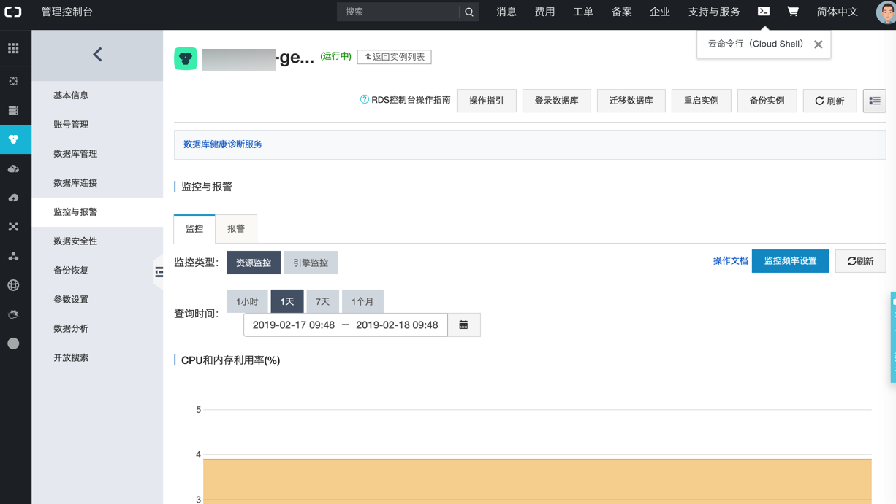
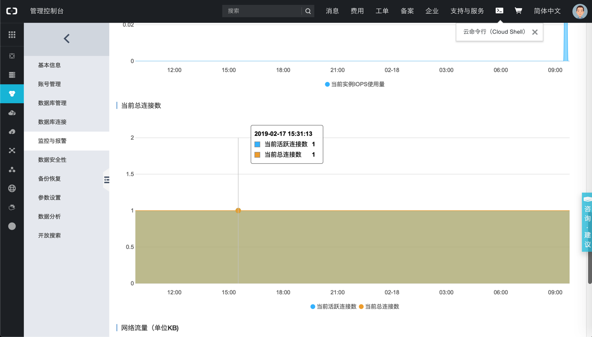
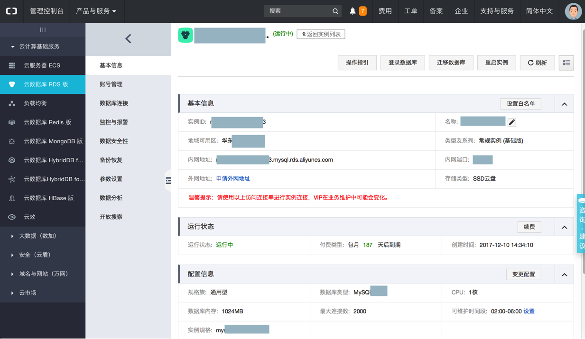

# 阿里云的RDS

此处整理关于阿里云的RDS的mysql数据库的内容。

`RDS`=`Relational Database Service`=`关系型数据库服务`=`云数据库`

## 心得

### mysql监控

阿里云的RDS的mysql中，有自己的监控工具：



其中包括当前mysql的连接数：



### 备份阿里云的RDS的mysql数据库

此处去把，只能内网访问的阿里云的RDS的mysql数据库中某个表的数据，去备份到本地。

其实就是：

* 登录另外一台阿里云的ECS服务器
  * 两者同属一个内网，本身有互相访问的权限
* 然后去执行`mysqldump`去导出备份即可
  * 且（由于数据量很大，所以）用了`gzip`压缩以减小文件体积

具体命令是：

```bash
mysqldump --host=xxx.mysql.rds.aliyuncs.com --port=port --user=root —-password=your_password --default-character-set=utf8 dbanme | gzip > aliyun_rds_xxx_mysql_dump.sql.gz
```

或`-u`的用户名和`-p`的密码的参数重去掉空格的写法：

```bash
mysqldump -h xxx.mysql.rds.aliyuncs.com -P port -B dbname -uroot -pyour_password | gzip > aliyun_rds_xxx_mysql_dump.sql.gz
```

## 常见问题

### 无法连接RDS

之前用

```bash
mysql -h xxx.mysql.rds.aliyuncs.com -P xxx -B xxx -uroot -p
```

结果：无法连上阿里云的RDS的MySQL数据库



原因：给参数时`-uroot`是错误的。

根本原因：给的参数是之前参考了`mysqldump`的写法

解决办法：把`-uroot`改为`-u root`，即可。

附录：

完整命令行是：

* 只登录，不选择指定哪个数据库
    ```bash
    mysql -h xx-xxx.mysql.rds.aliyuncs.com -u root -p
    ```
* 登录，且指定使用具体的数据库
    ```bash
    mysql -h xx-xxx.mysql.rds.aliyuncs.com -u root -p dbname
    ```

## 连接报错：pymysql.err.OperationalError 2003 Can't connect to MySQL server on mysql.rds.aliyuncs.com Errno 61 Connection refused

此处Flask的python中pymysql去连接远程mysql数据库`xxx.mysql.rds.aliyuncs.com`出错：

```bash
  File "/Users/crifan/.local/share/virtualenvs/robotDemo-HXjMJQEQ/lib/python3.6/site-packages/pymysql/connections.py", line 967, in connect
    raise exc
pymysql.err.OperationalError: (2003, "Can't connect to MySQL server on 'xxx.mysql.rds.aliyuncs.com' ([Errno 61] Connection refused)")
```

原因：

这个mysql `xxx.mysql.rds.aliyuncs.com` 是阿里云的RDS数据库专用服务器，该名字是阿里云内网才能识别的名字，外网无法访问，只能内网（同处一个区域的服务器）访问。

解决办法：

* 开通外网访问权限
  * 此处，为了更加安全考虑，就不去开放外网访问权限了
* 改为内网（甚至RDS本机）访问
  * 阿里云后台可以针对RDS数据库申请外网IP，再去加上IP白名单，也可以实现很好的安全控制
  * 所以采用：把服务器中的mysql，去用（登录阿里云ECS，和RDS数据库服务器同属于一个内网）mysqldump去导出子表，然后导入到Mac本地刚建mysql数据库，然后再去把配置改为：
    ```python
    config = {
        #'host': 'xxx.mysql.rds.aliyuncs.com',
        'host': "127.0.0.1",
        'port': 3306,
        'user': 'root',
        'password': 'xxxx',
        'db': 'yourDB',
        'charset': 'utf8',
    }
    ```
  * 即可正常连接
